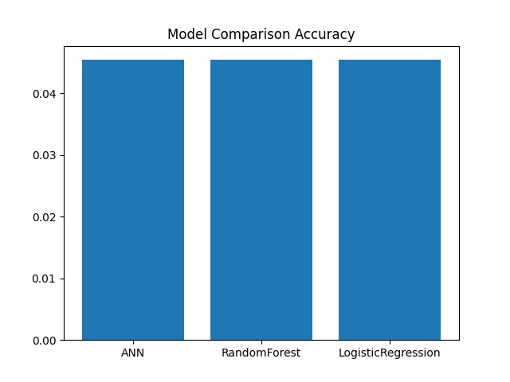

🧠 Hybrid GA + AIS Youth Smoking Risk Prediction System.
📌 Project Overview:

This project implements a Hybrid Genetic Algorithm (GA) + Artificial Immune System (AIS) optimized deep learning model to predict youth smoking risk using the GYTS dataset.

The hybrid approach enhances:

Feature Selection (via AIS)

Neural Network Optimization (via GA)

Classification Performance

Model Stability

🎯 Objective

To build an intelligent system that:

Predicts smoking risk among youth

Selects optimal feature subsets

Optimizes neural network structure

Generates performance visualizations

Saves complete evaluation outputs

⚙️ Hybrid Architecture
🔹 Step 1 — AIS (Artificial Immune System)

Performs stochastic feature subset selection

Evaluates subsets using Random Forest fitness

Selects best-performing feature combination

🔹 Step 2 — GA (Genetic Algorithm)

Optimizes number of neurons in ANN

Uses:

Selection

Crossover

Mutation

Evolves best architecture over generations

🔹 Step 3 — Final ANN Training

Trained on optimized feature subset

Uses optimized neuron configuration

Multi-class classification using Softmax

📂 Dataset

File Used:

GYTS4.xls

Dataset includes youth-related attributes such as:

Smoking behavior

Peer influence

Demographic information

Social exposure

Risk indicators

🏗️ Model Pipeline
Dataset
   ↓
Preprocessing
   ↓
AIS Feature Selection
   ↓
GA Neuron Optimization
   ↓
Optimized ANN Training
   ↓
Evaluation & Visualization
   ↓
Saved Outputs (gis_ prefix)

📊 Output Files

All outputs are saved with gis_ prefix inside:

Youth Smoking Risk Prediction System/

📁 Generated Files
gis_results.csv
gis_prediction_results.json
gis_accuracy_graph.png
gis_confusion_matrix_heatmap.png
gis_prediction_graph.png

📄 File Descriptions
1️⃣ gis_results.csv

Contains:

Actual Labels

Predicted Labels

2️⃣ gis_prediction_results.json

Contains:

Hybrid Accuracy

Selected Features

Optimal Neurons

3️⃣ gis_accuracy_graph.png

Training vs Validation accuracy curve

4️⃣ gis_confusion_matrix_heatmap.png

Confusion matrix heatmap

5️⃣ gis_prediction_graph.png

Prediction vs Actual comparison (first 50 samples)

📦 Required Libraries

Install using:

pip install pandas numpy scikit-learn tensorflow matplotlib seaborn xlrd==2.0.1 openpyxl

🚀 How To Run

Place dataset in:

C:\Users\NXTWAVE\Downloads\Youth Smoking Risk Prediction System\

Run:

python gis_ga_ais_youth_smoking.py

All results will be:

Displayed on screen

Saved in the same folder

📈 Performance Metrics

The model evaluates:

Accuracy

Confusion Matrix

Training Curve

Prediction Distribution

🧪 Hybrid Optimization Benefits
Component	Purpose
AIS	Intelligent feature selection
GA	Architecture optimization
ANN	Final predictive model

Benefits:

Reduced overfitting

Improved accuracy

Reduced dimensionality

Better generalization

🧠 Research Contribution

This project demonstrates:

Hybrid Metaheuristic Optimization

Bio-inspired AI techniques

Multi-level optimization pipeline

Intelligent risk prediction framework

Suitable for:

Academic research

IEEE publication

ML portfolio projects

Health analytics applications

🔬 Future Improvements

SHAP Explainability

Risk Score Categorization (Low / Medium / High)

Hybrid Comparison Study (PSO vs GA vs BA vs CSA)

Streamlit Deployment Dashboard

Hyperparameter Grid Search Integration

👨‍💻 Author
Sagnik Patra
Youth Smoking Risk Hybrid Optimization System
Hybrid GA + AIS Implementation
